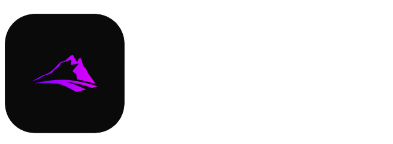

# UnEngine Documentation

Welcome to UnEngine Network, an immersive Minecraft server that offers a unique gaming experience. At UnEngine, we pride ourselves on delivering exciting gameplay with a variety of features including Bedwars, Oneblock, and a custom survival mode. Our server is designed to provide endless entertainment and create a vibrant community for players of all skill levels.

Welcome to the official UnEngine Server wiki, here you can find tutorials and information about the server

## User Commands


[commands.md](commands/commands.md)


## Vehicles


[vehicles.md](commands/vehicles.md)


## Parties


[parties.md](commands/parties.md)


## FAQ


[faq.md](faq.md)




